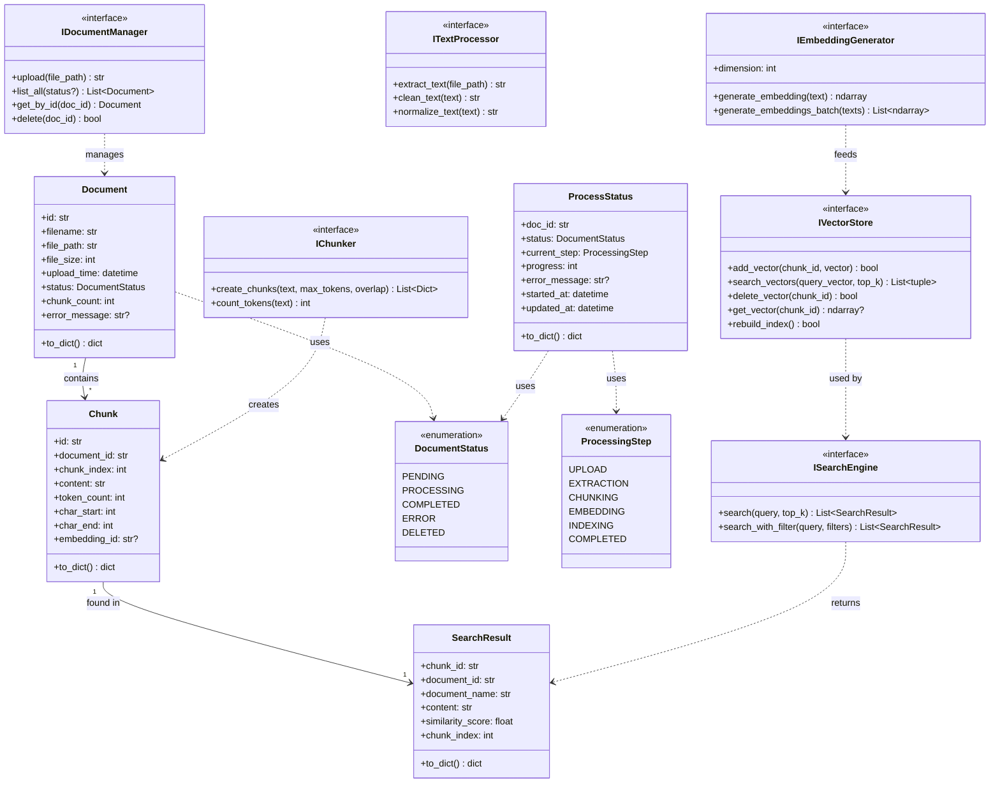
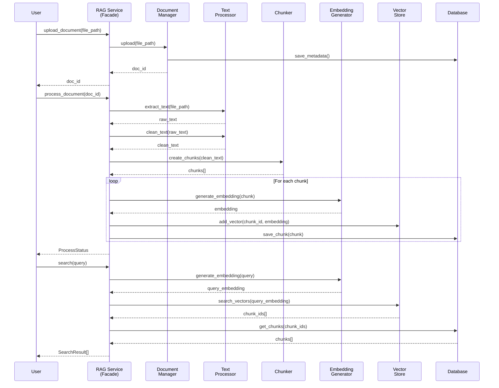
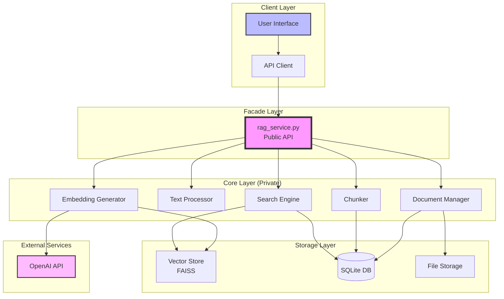
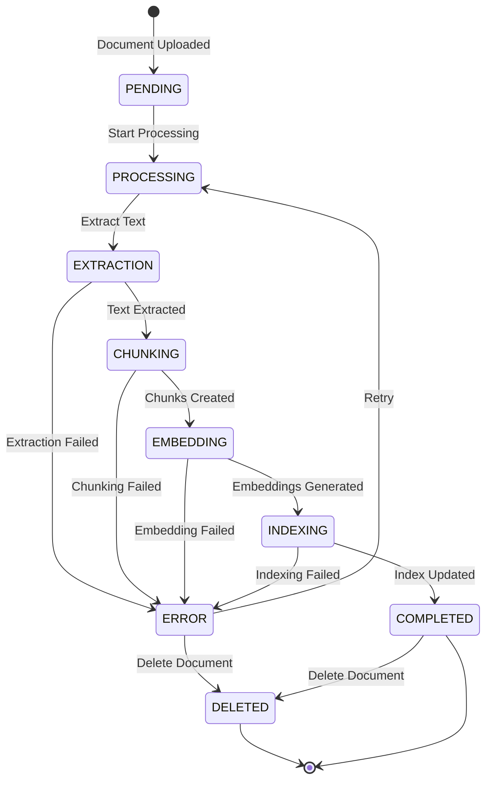
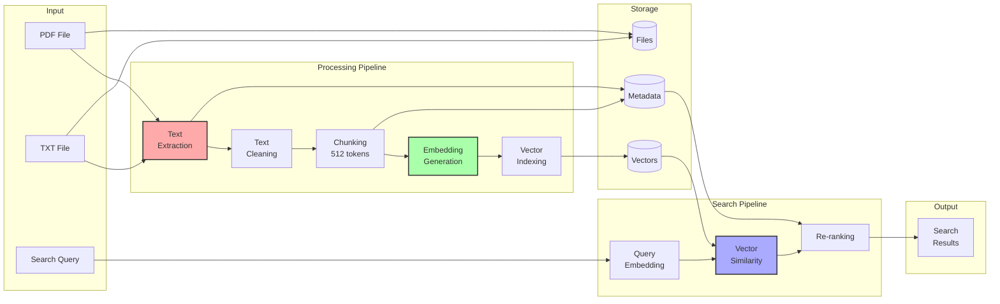

# RAG System Architecture Diagrams
Generated from interface_spec.py

## 1. Class Diagram (클래스 다이어그램)
Shows the structure of data models, enums, and interfaces.



## 2. Sequence Diagram (시퀀스 다이어그램)
Shows the interaction flow for document processing and search.



## 3. Component Diagram (컴포넌트 다이어그램)
Shows the system architecture and dependencies.



## 4. State Diagram (상태 다이어그램)
Shows document processing states.



## 5. Data Flow Diagram (데이터 플로우 다이어그램)
Shows how data flows through the system.



## How to View

### Option 1: GitHub
GitHub automatically renders Mermaid diagrams in markdown files.

### Option 2: Mermaid Live Editor
1. Go to https://mermaid.live/
2. Copy the diagram code
3. Paste and view

### Option 3: VS Code Extension
Install "Markdown Preview Mermaid Support" extension.

### Option 4: Generate Images
```bash
# Install mermaid-cli
npm install -g @mermaid-js/mermaid-cli

# Generate SVG/PNG
mmdc -i diagram.mmd -o output.svg
```
