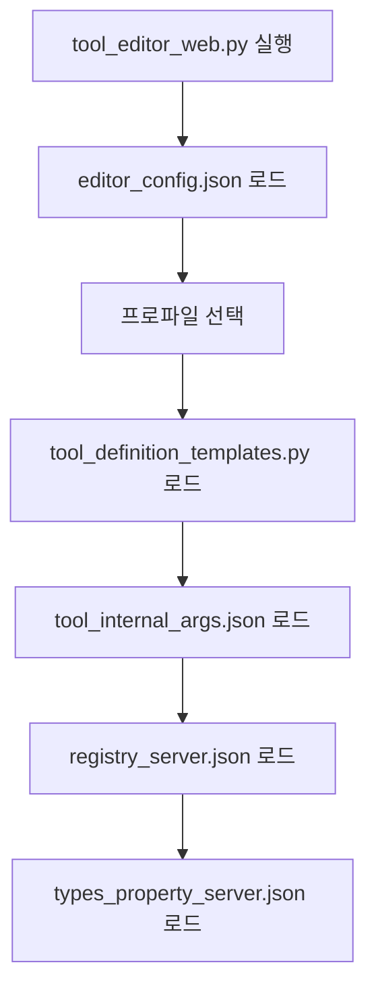

# MCP Editor 파일 생성 및 호출 관계 분석

## 📁 생성되는 파일 목록

### 1. 툴 정의 파일

#### 1.1 tool_definition_templates.py
- **경로**: `mcp_{server}/tool_definition_templates.py`
- **용도**: 웹 에디터용 템플릿 (메타데이터 포함)
- **생성 시점**: Save 버튼 클릭 시
- **생성 함수**: `save_tool_definitions()`
- **특징**:
  - mcp_service 메타데이터 포함
  - AST 파싱으로 추출한 시그니처 포함
  - 웹 에디터에서 직접 사용

#### 1.2 tool_definitions.py
- **경로**: `../mcp_{server}/mcp_server/tool_definitions.py`
- **용도**: 실제 MCP 서버용 정의
- **생성 시점**: Save 버튼 클릭 시
- **생성 함수**: `save_tool_definitions()`
- **특징**:
  - mcp_service 메타데이터 제거 (clean version)
  - 기본값(defaults) 제거
  - JSON.loads() 형식으로 생성

#### 1.3 백업 파일
- **경로**: `mcp_{server}/backups/tool_definitions_{YYYYMMDD_HHMMSS}.py`
- **용도**: 이전 버전 백업
- **생성 시점**: 매 Save 시
- **관리**: 최근 10개만 유지 (자동 삭제)

### 2. 내부 인자 파일

#### 2.1 tool_internal_args.json
- **경로**: `mcp_{server}/tool_internal_args.json`
- **용도**: 툴의 내부 파라미터 정의
- **생성 시점**: Internal Args 저장 시
- **생성 함수**: `save_internal_args()`
- **형식**:
```json
{
  "tool_name": {
    "param_name": {
      "type": "str",
      "default": "default_value"
    }
  }
}
```

### 3. 레지스트리 파일

#### 3.1 registry_{server}.json
- **경로**: `mcp_service_registry/registry_{server}.json`
- **용도**: 서비스 메타데이터 및 시그니처
- **생성 방법**: `meta_registry.py` 스크립트 실행
- **내용**:
  - 서비스 이름
  - 핸들러 정보 (클래스, 인스턴스, 모듈)
  - 파라미터 시그니처
  - 메타데이터

#### 3.2 types_property_{server}.json
- **경로**: `mcp_service_registry/types_property_{server}.json`
- **용도**: 타입 클래스 속성 정보
- **생성 방법**: `extract_types.py` 스크립트 실행
- **내용**:
  - BaseModel 클래스 목록
  - 각 클래스의 속성 정보
  - 타입 매핑

### 4. 설정 파일

#### 4.1 editor_config.json
- **경로**: `mcp_editor/editor_config.json`
- **용도**: 에디터 프로파일 설정
- **생성 방법**: `generate_editor_config.py` 또는 수동 생성
- **구조**:
```json
{
  "mcp_{server}": {
    "template_definitions_path": "mcp_{server}/tool_definition_templates.py",
    "tool_definitions_path": "../mcp_{server}/mcp_server/tool_definitions.py",
    "backup_dir": "mcp_{server}/backups",
    "types_files": ["../mcp_{server}/{server}_types.py"],
    "host": "0.0.0.0",
    "port": 8091
  }
}
```

### 5. 레거시/미사용 파일
- `{server}_mcp_services.json` - 구 버전 서비스 정보
- `{server}_mcp_services_detailed.json` - 상세 서비스 메타데이터
- `mcp_services.json` - fallback용

## 🔄 파일 호출 관계

### 1. 웹 에디터 시작 시 로드 순서



**상세 호출 체인:**
1. `_load_config_file()` → `editor_config.json` 읽기
2. `load_tool_definitions()` → `tool_definition_templates.py` 파싱
3. `load_internal_args()` → `tool_internal_args.json` 로드
4. `_load_services_for_server()` → `registry_{server}.json` 로드
   - 없으면 FileNotFoundError 발생 (로그 출력)
   - force_rescan=True면 AST 스캔 fallback

### 2. Save 버튼 클릭 시 생성 순서

```mermaid
graph TD
    A[Save 버튼 클릭] --> B[/api/save-all 호출]
    B --> C[백업 파일 3개 동시 생성]
    C --> D[save_tool_definitions 호출]
    D --> E[tool_definitions.py 생성]
    D --> F[tool_definition_templates.py 생성]
    B --> G[save_internal_args 호출]
    G --> H[tool_internal_args.json 저장]
```

**상세 처리 과정 (/api/save-all):**
1. **백업 생성** (동일 timestamp로 3개 파일):
   - `backups/tool_definitions_{timestamp}.py`
   - `backups/tool_definition_templates_{timestamp}.py`
   - `backups/tool_internal_args_{timestamp}.json`

2. **save_tool_definitions() 호출**:
   - Clean 버전 생성: 메타데이터 제거 → `tool_definitions.py`
   - 시그니처 추출: `registry_{server}.json` 또는 AST 스캔
   - 템플릿 생성: 메타데이터 포함 → `tool_definition_templates.py`

3. **save_internal_args() 호출**:
   - 내부 인자 저장 → `tool_internal_args.json`

4. **정리 작업**:
   - 백업 파일 10개 초과 시 오래된 것 삭제

### 3. API 엔드포인트별 파일 접근

#### /api/mcp-services
**우선순위별 시도:**
1. `mcp_service_registry/registry_{server}.json` (새 형식)
2. `mcp_{server}/{server}_mcp_services.json` (구 형식)
3. `{server}_mcp_services.json` (레거시)
4. 없으면 에러 반환 (레지스트리 없음 로그)

#### /api/types-properties
**우선순위별 시도:**
1. `mcp_service_registry/types_property_{server}.json`
2. `mcp_{server}/types_properties.json`
3. `types_properties.json` (레거시)
4. 없으면 빈 응답 반환

#### /api/tools (GET)
**로드 순서:**
1. `tool_definition_templates.py` 로드
2. fallback: `tool_definitions.py`
3. 백업 파일 목록 조회

## 📊 파일 생성/업데이트 매트릭스

| 파일 | 생성 시점 | 업데이트 시점 | 생성 함수 | 삭제 시점 |
|------|----------|--------------|-----------|----------|
| tool_definition_templates.py | 첫 Save | 매 Save | save_tool_definitions() | 수동 |
| tool_definitions.py | 첫 Save | 매 Save | save_tool_definitions() | 수동 |
| tool_internal_args.json | 첫 Save | 매 Save | save_internal_args() (/api/save-all) | 수동 |
| registry_{server}.json | meta_registry.py 실행 | 재실행 시 | MCPMetaRegistry.export_manifest() | 수동 |
| types_property_{server}.json | extract_types.py 실행 | 재실행 시 | extract_and_save_properties() | 수동 |
| editor_config.json | 초기 설정 | 프로파일 추가 | generate_editor_config.py | 수동 |
| backups/*.py, *.json | 매 Save | - | /api/save-all | 10개 초과 시 자동 |

## 🔗 주요 함수 콜 체인

### 툴 정의 로드
```
load_tool_definitions(paths)
  ├→ load_from_template_source()
  │   ├→ importlib.util.spec_from_file_location()
  │   └→ module.MCP_TOOLS
  └→ fallback: tool_definitions.py 로드
```

### 툴 정의 저장 (Save 버튼)
```
/api/save-all 엔드포인트
  ├→ 백업 생성 (3개 파일 동시)
  ├→ save_tool_definitions(tools_data, paths, force_rescan, skip_backup=True)
  │   ├→ clean_tools 생성 (메타데이터 제거)
  │   ├→ tool_definitions.py 쓰기
  │   ├→ _load_services_for_server()
  │   │   ├→ registry_{server}.json 로드
  │   │   └→ 또는 AST 스캔
  │   └→ tool_definition_templates.py 쓰기
  ├→ save_internal_args(internal_args, paths)
  │   └→ tool_internal_args.json 쓰기
  └→ cleanup_old_backups()
```

### 서비스 메타데이터 로드
```
_load_services_for_server(server_name, scan_dir, force_rescan)
  ├→ registry_{server}.json 확인
  │   ├→ 있음: JSON 파싱
  │   └→ 없음: FileNotFoundError (로그)
  └→ force_rescan=True: AST 스캔
      └→ get_services_map()
```

### 내부 인자 처리
```
load_internal_args(paths)
  └→ tool_internal_args.json 읽기

save_internal_args(internal_args, paths)
  └→ tool_internal_args.json 쓰기
```

## ⚠️ 에러 처리 및 로깅

### 레지스트리 파일 없음
- **위치**: `_load_services_for_server()`
- **처리**:
  ```python
  if not os.path.exists(registry_path):
      error_msg = f"Registry file not found: {registry_path}"
      print(f"ERROR: {error_msg}")
      raise FileNotFoundError(error_msg)
  ```
- **영향**:
  - API는 에러 메시지 반환
  - Save는 시그니처 없이 계속 진행

### 타입 파일 없음
- **위치**: `/api/types-properties`
- **처리**: 빈 응답 반환
  ```json
  {
    "classes": [],
    "properties_by_class": {},
    "all_properties": [],
    "has_types": false
  }
  ```

### 백업 관리
- **최대 개수**: 10개
- **정리 함수**: `cleanup_old_backups()`
- **정렬**: 날짜 역순

## 🚀 파일 생성 명령어

### 레지스트리 생성
```bash
cd /home/kimghw/Connector_auth/mcp_editor/mcp_service_registry
python meta_registry.py --base-dir ../../mcp_outlook --server-name outlook
```

### 타입 속성 추출
```bash
cd /home/kimghw/Connector_auth/mcp_editor/mcp_service_registry
python extract_types.py
```

### 에디터 설정 생성
```bash
cd /home/kimghw/Connector_auth/mcp_editor
python generate_editor_config.py
```

## 📝 참고 사항

1. **파일 동기화**: tool_definition_templates.py와 tool_definitions.py는 항상 동기화됨
2. **메타데이터 보존**: 템플릿 파일만 메타데이터 포함, 서버용은 clean 버전
3. **캐싱**: 서비스 시그니처는 캐싱되어 성능 향상
4. **자동 정리**: 백업 파일은 10개 초과 시 자동 삭제
5. **에러 복구**: 레지스트리 없어도 기본 동작은 가능 (시그니처만 누락)