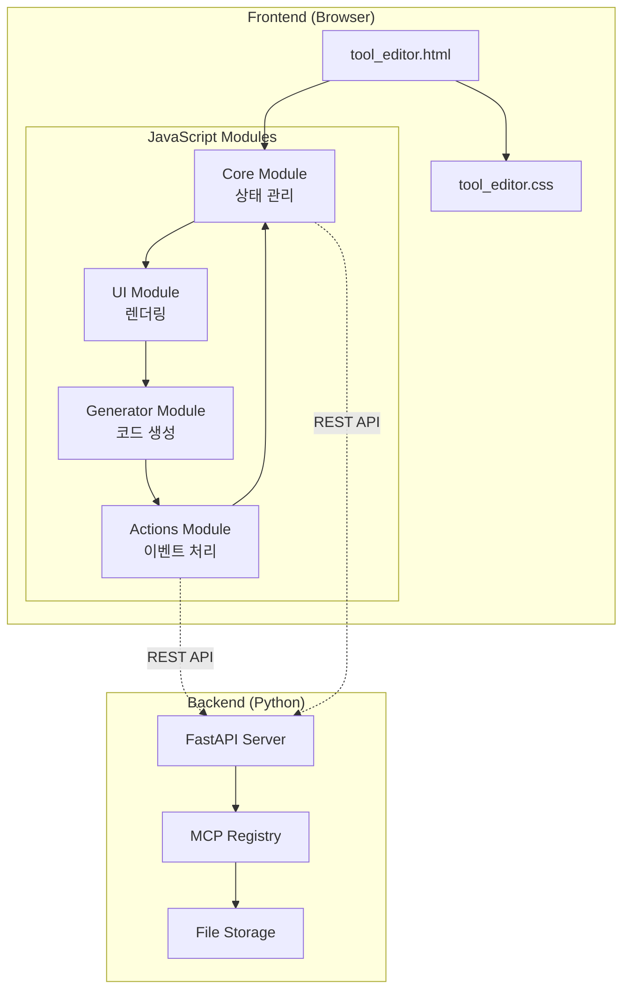

# MCP 웹에디터 아키텍처 문서

## 시스템 아키텍처 개요

### 1. 계층 구조

```
┌──────────────────────────────────────────────┐
│                Presentation Layer            │
│         (HTML + CSS + JavaScript UI)         │
├──────────────────────────────────────────────┤
│              Application Layer               │
│    (JavaScript Core + Actions + Generator)   │
├──────────────────────────────────────────────┤
│                 Service Layer                │
│            (FastAPI REST API)               │
├──────────────────────────────────────────────┤
│                 Data Layer                   │
│         (JSON Files + File System)          │
└──────────────────────────────────────────────┘
```

### 2. 컴포넌트 다이어그램



## 모듈별 상세 설계

### Core Module (tool_editor_core.js)

#### 책임
- 애플리케이션 상태 관리
- API 통신 처리
- 데이터 검증 및 변환

#### 상태 관리 구조
```javascript
const AppState = {
    // 서버 관련
    servers: [],           // 사용 가능한 서버 목록
    currentServer: null,   // 현재 선택된 서버

    // 툴 관련
    tools: {},            // 서버별 툴 목록 캐시
    currentTool: null,    // 현재 편집 중인 툴
    originalToolData: null, // 변경 전 원본 데이터

    // UI 상태
    isLoading: false,     // 로딩 상태
    hasChanges: false,    // 변경사항 존재 여부

    // 설정
    autoSave: false,      // 자동 저장 활성화
    debugMode: false      // 디버그 모드
};
```

#### API 인터페이스
```javascript
const API = {
    baseURL: '/api',

    // 서버 관련
    getServers: () => fetch(`${API.baseURL}/servers`),
    getServerTools: (server) => fetch(`${API.baseURL}/servers/${server}/tools`),

    // 툴 관련
    getTool: (server, tool) => fetch(`${API.baseURL}/servers/${server}/tools/${tool}`),
    saveTool: (server, tool, data) => fetch(`${API.baseURL}/servers/${server}/tools/${tool}`, {
        method: 'PUT',
        headers: {'Content-Type': 'application/json'},
        body: JSON.stringify(data)
    }),
    deleteTool: (server, tool) => fetch(`${API.baseURL}/servers/${server}/tools/${tool}`, {
        method: 'DELETE'
    }),

    // 코드 생성
    generateServer: (server, protocol) => fetch(`${API.baseURL}/generate/server`, {
        method: 'POST',
        headers: {'Content-Type': 'application/json'},
        body: JSON.stringify({server_name: server, protocol: protocol})
    })
};
```

### UI Module (tool_editor_ui.js)

#### 책임
- DOM 조작 및 렌더링
- 사용자 인터페이스 업데이트
- 시각적 피드백 제공

#### 컴포넌트 구조
```javascript
const UIComponents = {
    // 레이아웃 컴포넌트
    header: {
        render: () => {},
        update: (state) => {}
    },

    sidebar: {
        render: () => {},
        update: (tools) => {},
        highlight: (toolName) => {}
    },

    editor: {
        render: () => {},
        update: (tool) => {},
        validate: () => {}
    },

    // 재사용 가능한 위젯
    parameterTable: {
        render: (parameters) => {},
        addRow: () => {},
        deleteRow: (index) => {},
        updateRow: (index, data) => {}
    },

    modal: {
        show: (content, options) => {},
        hide: () => {},
        confirm: (message) => Promise
    },

    notification: {
        success: (message) => {},
        error: (message) => {},
        warning: (message) => {},
        info: (message) => {}
    }
};
```

#### 렌더링 파이프라인
```
데이터 변경 → 상태 업데이트 → UI 컴포넌트 렌더링 → DOM 업데이트
     ↑                                              ↓
     └─────────── 사용자 입력 ←──────────────────────┘
```

### Actions Module (tool_editor_actions.js)

#### 책임
- 사용자 이벤트 처리
- 비즈니스 로직 실행
- 모듈 간 조정

#### 이벤트 처리 흐름
```javascript
const EventFlow = {
    // 1. 이벤트 캡처
    capture: (event) => {
        event.preventDefault();
        return normalizeEvent(event);
    },

    // 2. 검증
    validate: (event) => {
        // 입력 검증
        // 권한 확인
        // 상태 확인
    },

    // 3. 처리
    process: async (event) => {
        // 비즈니스 로직 실행
        // API 호출
        // 상태 업데이트
    },

    // 4. UI 업데이트
    update: (result) => {
        // UI 모듈 호출
        // 피드백 제공
    },

    // 5. 부수 효과
    sideEffects: (result) => {
        // 로깅
        // 분석
        // 캐시 업데이트
    }
};
```

#### 액션 매핑
```javascript
const ActionHandlers = {
    // 서버 관련
    'server:select': handleServerChange,
    'server:refresh': handleServerRefresh,
    'server:generate': handleServerGenerate,

    // 툴 관련
    'tool:select': handleToolSelect,
    'tool:create': handleToolCreate,
    'tool:save': handleToolSave,
    'tool:delete': handleToolDelete,
    'tool:duplicate': handleToolDuplicate,

    // 파라미터 관련
    'param:add': handleParameterAdd,
    'param:delete': handleParameterDelete,
    'param:update': handleParameterUpdate,
    'param:reorder': handleParameterReorder,

    // UI 관련
    'ui:theme': handleThemeToggle,
    'ui:reset': handleUIReset,
    'ui:export': handleExport,
    'ui:import': handleImport
};
```

### Generator Module (tool_editor_generator.js)

#### 책임
- Python 코드 생성
- JSON Schema 생성
- 코드 포맷팅 및 검증

#### 코드 생성 템플릿
```javascript
const Templates = {
    // MCP 서버 템플릿
    server: {
        stdio: `
import asyncio
from mcp.server.models import InitializationOptions
from mcp.server.stdio import stdio_server
{imports}

@stdio_server()
class {ServerName}:
    {tools}
`,
        sse: `
from mcp.server.sse import create_sse_server
{imports}

server = create_sse_server("{server_name}")
{tools}
`
    },

    // 툴 정의 템플릿
    tool: `
@server.tool()
async def {tool_name}({parameters}):
    """
    {description}
    """
    {implementation}
`,

    // 스키마 템플릿
    schema: {
        string: {type: "string"},
        number: {type: "number"},
        boolean: {type: "boolean"},
        object: {type: "object", properties: {}},
        array: {type: "array", items: {}}
    }
};
```

#### 코드 생성 파이프라인
```
툴 정의 → 스키마 생성 → 파라미터 변환 → 코드 템플릿 적용 → 포맷팅 → 검증
```

## 데이터 모델

### 툴 정의 스키마
```typescript
interface Tool {
    name: string;                  // 툴 이름
    description: string;           // 툴 설명
    internal?: boolean;            // 내부 전용 여부
    parameters: Parameter[];       // 파라미터 목록
    returns?: ReturnType;          // 반환 타입
    metadata?: {                   // 메타데이터
        author?: string;
        version?: string;
        tags?: string[];
    };
}

interface Parameter {
    name: string;                  // 파라미터 이름
    type: ParameterType;           // 파라미터 타입
    description?: string;          // 설명
    required?: boolean;            // 필수 여부
    default?: any;                 // 기본값
    enum?: string[];              // 열거형 값
    pattern?: string;             // 정규식 패턴
    minimum?: number;             // 최소값
    maximum?: number;             // 최대값
}

type ParameterType =
    | "string"
    | "number"
    | "boolean"
    | "object"
    | "array"
    | "file"
    | "url"
    | "email";
```

### 서버 구성 스키마
```typescript
interface ServerConfig {
    name: string;                  // 서버 이름
    protocol: "stdio" | "sse";     // 프로토콜
    port?: number;                 // SSE 포트
    tools: Tool[];                 // 툴 목록
    settings?: {                   // 서버 설정
        timeout?: number;
        maxConnections?: number;
        authentication?: boolean;
    };
}
```

## 통신 프로토콜

### REST API 명세

#### 엔드포인트 구조
```
BASE_URL: http://localhost:8000/api

/servers                      # 서버 목록
/servers/{name}              # 서버 정보
/servers/{name}/tools        # 서버의 툴 목록
/servers/{name}/tools/{tool} # 특정 툴 정보
/generate/server             # 서버 코드 생성
/generate/tool               # 툴 코드 생성
/validate/schema             # 스키마 검증
```

#### 요청/응답 형식
```javascript
// 요청 헤더
{
    "Content-Type": "application/json",
    "Accept": "application/json"
}

// 성공 응답
{
    "status": "success",
    "data": {...},
    "timestamp": "2025-12-26T12:00:00Z"
}

// 에러 응답
{
    "status": "error",
    "error": {
        "code": "VALIDATION_ERROR",
        "message": "Invalid parameter type",
        "details": {...}
    },
    "timestamp": "2025-12-26T12:00:00Z"
}
```

## 보안 고려사항

### 입력 검증
```javascript
const SecurityValidation = {
    // XSS 방지
    sanitizeHTML: (input) => {
        return input.replace(/<script\b[^<]*(?:(?!<\/script>)<[^<]*)*<\/script>/gi, '');
    },

    // 인젝션 방지
    sanitizeCode: (code) => {
        // 위험한 패턴 검사
        const dangerousPatterns = [
            /exec\(/,
            /eval\(/,
            /__import__/,
            /subprocess/
        ];

        return dangerousPatterns.some(p => p.test(code));
    },

    // 파일 경로 검증
    validatePath: (path) => {
        return !path.includes('..') && !path.startsWith('/');
    }
};
```

### 인증 및 권한
```javascript
const Auth = {
    // 토큰 기반 인증
    authenticate: async (token) => {
        // 토큰 검증
    },

    // 권한 확인
    authorize: (user, action) => {
        // 권한 매트릭스 확인
    },

    // 세션 관리
    session: {
        create: () => {},
        validate: () => {},
        destroy: () => {}
    }
};
```

## 성능 최적화

### 캐싱 전략
```javascript
const CacheStrategy = {
    // 메모리 캐시
    memory: new Map(),

    // 로컬 스토리지 캐시
    localStorage: {
        get: (key) => JSON.parse(localStorage.getItem(key)),
        set: (key, value) => localStorage.setItem(key, JSON.stringify(value)),
        clear: () => localStorage.clear()
    },

    // 캐시 무효화
    invalidate: (pattern) => {
        // 패턴 매칭으로 캐시 항목 제거
    }
};
```

### 지연 로딩
```javascript
const LazyLoad = {
    // 모듈 지연 로딩
    loadModule: async (moduleName) => {
        const module = await import(`./modules/${moduleName}.js`);
        return module.default;
    },

    // 데이터 지연 로딩
    loadData: async (endpoint, options = {}) => {
        const {page = 1, limit = 20} = options;
        return fetch(`${endpoint}?page=${page}&limit=${limit}`);
    }
};
```

## 에러 처리

### 에러 계층 구조
```javascript
class MCPEditorError extends Error {
    constructor(message, code, details) {
        super(message);
        this.code = code;
        this.details = details;
    }
}

class ValidationError extends MCPEditorError {
    constructor(field, value, rule) {
        super(`Validation failed for ${field}`, 'VALIDATION_ERROR', {
            field, value, rule
        });
    }
}

class APIError extends MCPEditorError {
    constructor(endpoint, status, response) {
        super(`API call failed: ${endpoint}`, 'API_ERROR', {
            endpoint, status, response
        });
    }
}
```

### 에러 처리 흐름
```
에러 발생 → 에러 캡처 → 로깅 → 사용자 알림 → 복구 시도 → 폴백
```

## 테스트 전략

### 단위 테스트
```javascript
describe('Core Module', () => {
    describe('loadTools', () => {
        it('should load tools from server', async () => {
            const tools = await loadTools('test-server');
            expect(tools).toBeDefined();
            expect(Array.isArray(tools)).toBe(true);
        });
    });
});
```

### 통합 테스트
```javascript
describe('Tool Editor Integration', () => {
    it('should create and save a new tool', async () => {
        // 1. 서버 선택
        await selectServer('test-server');

        // 2. 새 툴 생성
        const tool = await createTool({
            name: 'test_tool',
            description: 'Test tool'
        });

        // 3. 파라미터 추가
        await addParameter(tool, {
            name: 'param1',
            type: 'string'
        });

        // 4. 저장
        const result = await saveTool(tool);
        expect(result.status).toBe('success');
    });
});
```

## 배포 고려사항

### 빌드 프로세스
```bash
# 개발 빌드
npm run build:dev

# 프로덕션 빌드
npm run build:prod

# 번들 분석
npm run analyze
```

### 환경별 설정
```javascript
const Config = {
    development: {
        apiURL: 'http://localhost:8000',
        debug: true,
        cache: false
    },

    staging: {
        apiURL: 'https://staging-api.example.com',
        debug: false,
        cache: true
    },

    production: {
        apiURL: 'https://api.example.com',
        debug: false,
        cache: true
    }
};
```

## 모니터링 및 로깅

### 로깅 레벨
```javascript
const Logger = {
    debug: (message, data) => console.debug(`[DEBUG] ${message}`, data),
    info: (message, data) => console.info(`[INFO] ${message}`, data),
    warn: (message, data) => console.warn(`[WARN] ${message}`, data),
    error: (message, data) => console.error(`[ERROR] ${message}`, data),

    // 원격 로깅
    remote: async (level, message, data) => {
        await fetch('/api/logs', {
            method: 'POST',
            body: JSON.stringify({level, message, data, timestamp: Date.now()})
        });
    }
};
```

### 성능 모니터링
```javascript
const Performance = {
    // API 응답 시간 측정
    measureAPI: async (fn, label) => {
        const start = performance.now();
        const result = await fn();
        const duration = performance.now() - start;

        Logger.info(`API ${label} took ${duration}ms`);
        return result;
    },

    // 렌더링 성능 측정
    measureRender: (fn, label) => {
        const start = performance.now();
        fn();
        const duration = performance.now() - start;

        Logger.info(`Render ${label} took ${duration}ms`);
    }
};
```

---

*문서 버전: 1.0.0*
*최종 업데이트: 2025-12-26*