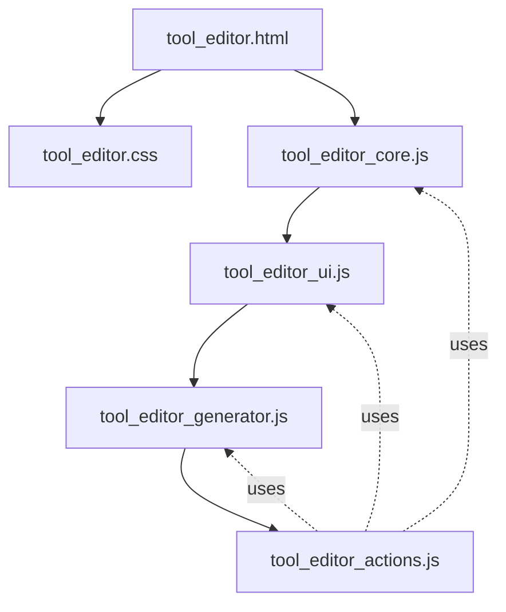

# MCP 웹에디터 리팩토링 가이드

## 📋 목차
1. [프로젝트 개요](#프로젝트-개요)
2. [아키텍처](#아키텍처)
3. [모듈 구조](#모듈-구조)
4. [구현 세부사항](#구현-세부사항)
5. [API 레퍼런스](#api-레퍼런스)
6. [개발 가이드](#개발-가이드)
7. [마이그레이션 가이드](#마이그레이션-가이드)

---

## 프로젝트 개요

### 목적
MCP(Model Context Protocol) 툴 에디터를 단일 파일(5,189줄)에서 모듈화된 구조로 리팩토링하여 유지보수성과 확장성을 개선

### 핵심 개선사항
- **모듈화**: 단일 HTML 파일을 6개 독립 모듈로 분리
- **성능**: 병렬 로딩 및 캐싱 가능
- **유지보수**: 역할별 명확한 분리
- **확장성**: 새로운 기능 추가 용이

### 기술 스택
- **Frontend**: Vanilla JavaScript (ES5)
- **Styling**: CSS3 with CSS Variables
- **Backend**: Python FastAPI
- **Protocol**: MCP (Model Context Protocol)

---

## 아키텍처

### 시스템 구조
```
┌─────────────────────────────────────────┐
│           웹 브라우저 (Client)           │
├─────────────────────────────────────────┤
│  ┌─────────────────────────────────┐   │
│  │      tool_editor.html (View)     │   │
│  └─────────────────────────────────┘   │
│                   ↓                     │
│  ┌─────────────────────────────────┐   │
│  │    JavaScript Modules (Logic)    │   │
│  │  ┌──────────┐  ┌──────────┐     │   │
│  │  │   Core   │  │    UI    │     │   │
│  │  └──────────┘  └──────────┘     │   │
│  │  ┌──────────┐  ┌──────────┐     │   │
│  │  │ Actions  │  │Generator │     │   │
│  │  └──────────┘  └──────────┘     │   │
│  └─────────────────────────────────┘   │
└─────────────────────────────────────────┘
                    ↓ HTTP/REST
┌─────────────────────────────────────────┐
│         FastAPI Server (Backend)        │
├─────────────────────────────────────────┤
│  ┌─────────────────────────────────┐   │
│  │       MCP Service Registry       │   │
│  └─────────────────────────────────┘   │
│  ┌─────────────────────────────────┐   │
│  │      Tool Definition Store       │   │
│  └─────────────────────────────────┘   │
└─────────────────────────────────────────┘
```

### 데이터 플로우
```
사용자 입력 → Actions Module → Core Module → API Call
     ↑            ↓               ↓            ↓
UI Module ← UI Module ← Core Module ← API Response
```

---

## 모듈 구조

### 파일 구조
```
mcp_editor/
├── templates/
│   └── tool_editor.html          # HTML 구조 (84줄)
├── static/
│   ├── css/
│   │   └── tool_editor.css       # 스타일시트 (1,197줄)
│   └── js/
│       ├── tool_editor_core.js   # 핵심 로직 (496줄)
│       ├── tool_editor_ui.js     # UI 렌더링 (484줄)
│       ├── tool_editor_actions.js # 이벤트 처리 (654줄)
│       └── tool_editor_generator.js # 코드 생성 (448줄)
└── docs/
    ├── REFACTORING_GUIDE.md      # 이 문서
    └── REFACTORING_DETAILS.md    # 상세 내역
```

### 모듈 의존성


---

## 구현 세부사항

### 1. Core Module (`tool_editor_core.js`)

#### 역할
- 전역 상태 관리
- API 통신
- 데이터 처리

#### 주요 함수
```javascript
// 초기화
function initialize() {
    // 앱 초기화, 서버 및 툴 목록 로드
}

// 서버 관리
function loadServers() {
    // 사용 가능한 서버 목록 로드
}

// 툴 관리
function loadTools(serverName) {
    // 특정 서버의 툴 목록 로드
}

function loadToolDetails(serverName, toolName) {
    // 툴 상세 정보 로드
}

function saveCurrentTool() {
    // 현재 편집 중인 툴 저장
}
```

#### 전역 상태
```javascript
// 현재 상태
let currentServer = null;
let currentTool = null;
let tools = {};
let servers = [];
let originalToolData = null;
```

### 2. UI Module (`tool_editor_ui.js`)

#### 역할
- DOM 조작
- UI 컴포넌트 렌더링
- 시각적 피드백

#### 주요 함수
```javascript
// 서버 UI
function updateServerDropdown(servers) {
    // 서버 선택 드롭다운 업데이트
}

// 툴 목록 UI
function renderToolList(tools) {
    // 사이드바 툴 목록 렌더링
}

// 툴 상세 UI
function displayToolDetails(tool) {
    // 메인 에디터 영역에 툴 정보 표시
}

// 파라미터 테이블
function renderParametersTable(parameters) {
    // 파라미터 편집 테이블 생성
}

// 모달
function showModal(modalId, content) {
    // 모달 표시
}
```

### 3. Actions Module (`tool_editor_actions.js`)

#### 역할
- 사용자 이벤트 처리
- 비즈니스 로직 실행
- 모듈 간 조정

#### 주요 이벤트 핸들러
```javascript
// 서버 변경
function handleServerChange(event) {
    // 서버 선택 시 툴 목록 갱신
}

// 툴 선택
function handleToolSelect(toolName) {
    // 툴 선택 시 상세 정보 로드
}

// 파라미터 관리
function handleParameterAdd() {
    // 새 파라미터 추가
}

function handleParameterDelete(index) {
    // 파라미터 삭제
}

// 저장
function handleSave() {
    // 변경사항 저장
}
```

### 4. Generator Module (`tool_editor_generator.js`)

#### 역할
- Python 코드 생성
- JSON 스키마 생성
- 코드 포맷팅

#### 주요 함수
```javascript
// 툴 정의 생성
function generateToolDefinition(tool) {
    // MCP 툴 정의 코드 생성
    return pythonCode;
}

// 스키마 생성
function generateInputSchema(parameters) {
    // JSON Schema 생성
    return schema;
}

// 서버 코드 생성
function generateServerCode(serverName, tools) {
    // 완전한 MCP 서버 코드 생성
    return serverCode;
}
```

---

## API 레퍼런스

### REST Endpoints

#### 서버 관리
```http
GET /api/servers
# 응답: ["server1", "server2", ...]

GET /api/servers/{server_name}/tools
# 응답: {"tools": [...]}

GET /api/servers/{server_name}/tools/{tool_name}
# 응답: {"name": "...", "description": "...", "parameters": [...]}
```

#### 툴 관리
```http
POST /api/servers/{server_name}/tools/{tool_name}
Content-Type: application/json
{
    "description": "...",
    "parameters": [...]
}

DELETE /api/servers/{server_name}/tools/{tool_name}

PUT /api/servers/{server_name}/tools/{tool_name}
Content-Type: application/json
{
    "description": "...",
    "parameters": [...]
}
```

#### 코드 생성
```http
POST /api/generate/server
Content-Type: application/json
{
    "server_name": "...",
    "protocol": "stdio|sse"
}
# 응답: {"code": "..."}
```

### JavaScript API

#### Core API
```javascript
// 초기화
window.initialize();

// 서버 관련
window.loadServers();
window.selectServer(serverName);

// 툴 관련
window.loadTools(serverName);
window.loadToolDetails(serverName, toolName);
window.saveCurrentTool();
```

#### UI API
```javascript
// 렌더링
window.renderToolList(tools);
window.displayToolDetails(tool);
window.renderParametersTable(parameters);

// 모달
window.showModal(modalId, content);
window.hideModal(modalId);

// 알림
window.showNotification(message, type);
```

---

## 개발 가이드

### 새 기능 추가

#### 1. 새로운 파라미터 타입 추가
```javascript
// 1. tool_editor_ui.js에 렌더링 로직 추가
function renderCustomParameter(param) {
    // 커스텀 파라미터 UI 생성
}

// 2. tool_editor_actions.js에 핸들러 추가
function handleCustomParameter(event) {
    // 커스텀 파라미터 처리
}

// 3. tool_editor_generator.js에 코드 생성 로직 추가
function generateCustomParameterCode(param) {
    // 커스텀 파라미터 코드 생성
}
```

#### 2. 새로운 서버 프로토콜 지원
```javascript
// 1. tool_editor_generator.js에 프로토콜 템플릿 추가
const PROTOCOL_TEMPLATES = {
    stdio: "...",
    sse: "...",
    websocket: "..." // 새 프로토콜
};

// 2. UI에 선택 옵션 추가
<option value="websocket">WebSocket</option>
```

### 디버깅

#### 로깅 활성화
```javascript
// tool_editor_core.js
const DEBUG = true;

function log(message, data) {
    if (DEBUG) {
        console.log(`[MCP Editor] ${message}`, data);
    }
}
```

#### 네트워크 요청 모니터링
```javascript
// 브라우저 개발자 도구 콘솔에서
window.monitorRequests = true;
```

### 테스팅

#### 단위 테스트 예제
```javascript
// test/test_generator.js
describe('Generator Module', () => {
    it('should generate valid Python code', () => {
        const tool = {
            name: 'test_tool',
            description: 'Test',
            parameters: []
        };
        const code = generateToolDefinition(tool);
        assert(code.includes('def test_tool'));
    });
});
```

---

## 마이그레이션 가이드

### 기존 코드에서 마이그레이션

#### 1. 전역 함수 접근
```javascript
// 이전 (단일 파일)
loadTools();

// 이후 (모듈화)
window.loadTools(); // 또는 그대로 loadTools()
```

#### 2. 이벤트 핸들러 바인딩
```javascript
// 이전 (인라인)
<button onclick="saveCurrentTool()">

// 이후 (addEventListener)
document.getElementById('save-btn').addEventListener('click', handleSave);
```

#### 3. CSS 클래스 사용
```css
/* 이전 (인라인 스타일) */
<div style="display: flex; padding: 10px;">

/* 이후 (CSS 클래스) */
<div class="flex-container padded">
```

### 버전 호환성

#### 지원 브라우저
- Chrome 60+
- Firefox 55+
- Safari 11+
- Edge 79+

#### JavaScript 버전
- ES5 호환 (IE11 제외)
- ES6 모듈 시스템 미사용 (향후 계획)

---

## 향후 계획

### Phase 1: 모듈 시스템 (Q1 2025)
- [ ] ES6 모듈 전환
- [ ] TypeScript 도입
- [ ] 의존성 관리 개선

### Phase 2: UI 개선 (Q2 2025)
- [ ] React/Vue 도입 검토
- [ ] 컴포넌트 시스템
- [ ] 테마 지원

### Phase 3: 기능 확장 (Q3 2025)
- [ ] 실시간 협업
- [ ] 버전 관리
- [ ] 플러그인 시스템

### Phase 4: 성능 최적화 (Q4 2025)
- [ ] 코드 스플리팅
- [ ] 지연 로딩
- [ ] Service Worker

---

## 참고 자료

### 관련 문서
- [MCP Protocol Specification](https://modelcontextprotocol.io)
- [FastAPI Documentation](https://fastapi.tiangolo.com)
- [REFACTORING_DETAILS.md](./REFACTORING_DETAILS.md)

### 프로젝트 링크
- GitHub: [github.com/your-org/mcp-editor](https://github.com)
- Issues: [github.com/your-org/mcp-editor/issues](https://github.com)

### 연락처
- 개발팀: dev@example.com
- 기술 지원: support@example.com

---

*최종 업데이트: 2025-12-26*